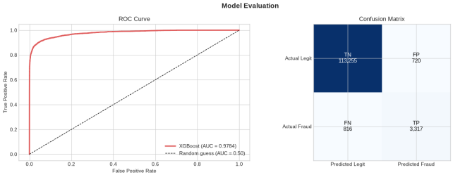
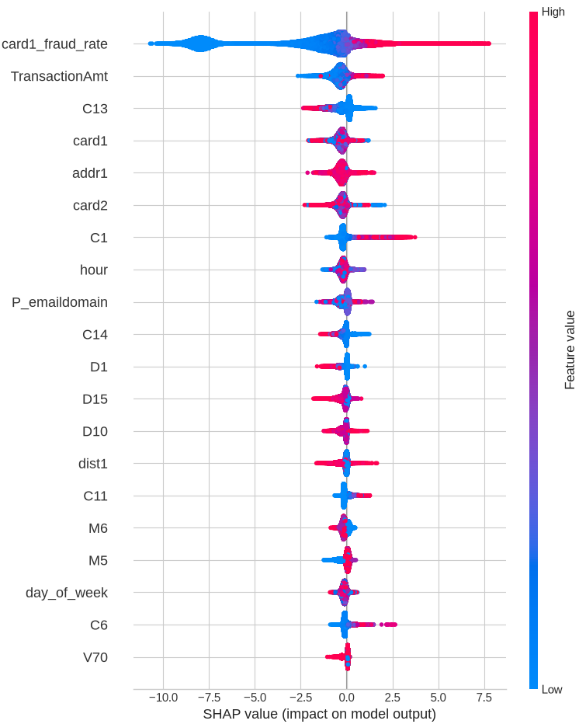
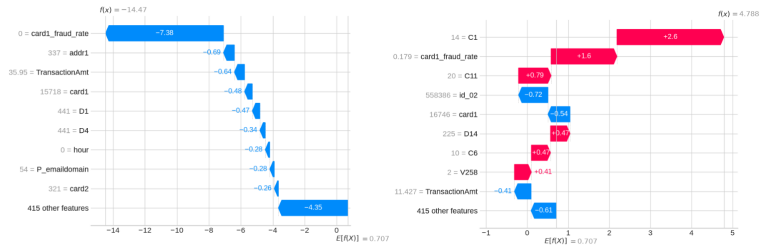

# PROJECT REPORT
# Topic: Real-time Financial Anomaly Detection in Transaction Streams with Explainable Output

Author: Hoang An Pham

Matriculation number: 10245923

Subject: AI in FinTech  DLMAIERAFT02


The purpose of our project is: build an explainable fraud-detection system that includes a transparent ML model, a streaming pipeline, and a live dashboard with feature-level alerts for suspicious transactions.

A machine learning project built on the [IEEE-CIS Fraud Detection dataset](https://www.kaggle.com/competitions/ieee-fraud-detection) from Kaggle. The goal was to build a model that can identify fraudulent ecommerce transactions from a dataset of 590,000 real-world payments.


---

## Results

| Metric | Score |
|---|---|
| ROC-AUC | **0.9549** |
| Fraud caught (Recall) | 85.4% |
| False alarm rate | 8.8% |

The Kaggle leaderboard winner on this competition scored ~0.945, so landing at 0.9549 on the validation set without heavy hyperparameter tuning was a good result for a first pass.

---

## Project Structure

```
ieee-fraud-detection/
│
├── data/
│   ├── train_transaction.csv     ← download from Kaggle (not included)
│   ├── train_identity.csv        ← download from Kaggle (not included)
│   └── processed/                ← generated by notebook 02
│       ├── X_train.csv
│       └── y_train.csv
│
├── notebooks/
│   ├── 01_eda.ipynb              ← exploratory data analysis
│   ├── 02_preprocessing.ipynb   ← cleaning, encoding, feature engineering
│   └── 03_model.ipynb           ← XGBoost training and evaluation
│
├── charts/                       ← saved figures from each notebook
├── requirements.txt
└── README.md
```

---

## Notebooks

**01 — Exploratory Data Analysis**  
We covers fraud rate and class imbalance, transaction amount distributions, fraud patterns by hour of day, product type breakdown, card network analysis, and missing value rates across 434 features.

**02 — Preprocessing & Feature Engineering**  
We perform feature engineering to cleaning up the raw data so it's ready for modelling. Drops columns with >90% missing values, fills the rest with -999 (a sentinel value that lets the model learn "data was absent"), label encodes categorical columns, and engineers 5 new features including hour of day, log-transformed amount, a round-number flag, and a card-level historical fraud rate.

**03 — Model Training & Evaluation**  
Trains an XGBoost classifier on the processed data. Uses `scale_pos_weight` to handle the class imbalance.

---
## Tech Stack Overview

Platform:
- 16 RAM
- WSL2


Software requirements:
| Sofware | Usage |
|---|---|
| pandas, numpy | peform feature engineering |
| scikit-learn | training XGBoost model |
| fastapi |  POST/REQUEST communicatin |
| kafka-python |streaming process |
| rich |live dashboard |
| shap |explainable framework |
| docker |always‑on service |
---


## How to Run
**1. Install docker**
- The application is running on docker image. Please make sure install it, in the case you use Window Docker version, please connect it with WSL2 in setting.

Docker link: https://docs.docker.com/engine/install/

**2. Clone the repo**
```bash
git clone https://github.com/yourusername/ieee-fraud-detection.git
cd ieee-fraud-detection
```
**3. Create virtual environment and activate**
```bash
conda create --prefix ./venv python=3.12
conda activate ./venv
```
In some cases, the conda virtual env does not include pip please install and make sure the setuptools library is at version 80.0, if not please process step 4.

```bash
conda install pip
pip install setuptools==80.0.0
```

**4. Install dependencies**
```bash
pip install -r requirements.txt
```

**5. Download the data**  

We provide you our preprocessed data (for demo and training model) and out 2 files under `data/preprocessed` (like in the folder structure above) at: https://drive.google.com/drive/folders/1PevrDMlWW68tMhNQv0JGiScual6ryt3x?usp=sharing

- **If you prefer to run the demo direction you may go to step 7 (not 6).**

- **If you prefer to run training you may go to step 6.**

In the case you want to train model please download original dataset:`train_transaction.csv` and `train_identity.csv` from the [Kaggle competition page](https://www.kaggle.com/competitions/ieee-fraud-detection/data) and place them in the `data/` folder.

**6. Run notebooks in order**  

If you use our preprocessed data above you can run 03_model.ipynb directly.

if you use the origianl dataset, you should open Jupyter and run in order:
- For EDA process to see details data insight: `01_eda.ipynb` 

- To perform feature engineering: `02_preprocessing.ipynb`

- To train the model on created feature: `03_model.ipynb`.  

Notebook 02 needs to finish before 03 since it generates the processed data files.

**7. Run demo**
Please make sure you already have the preprocessed datat (`X_train.csv` and `y_train.csv`) at `data/preprocessed` folder 

You need to open 3 terminal, activate the conda Virtual env like in step 3

- In terminal 1: Start Kafka and Start the API app
```bash
docker run -d --name kafka -p 9092:9092 apache/kafka:3.7.0
uvicorn main:app --reload
```
- In terminal 2: Start the dashboard, this is where you observe the predicted transaction
```bash
python dashboard.py
```
- In terminal 3: Start the producer
```bash
python producer.py
```

---

## Key Findings from EDA

- You may go to notebook 01_eda.ipynb, 02_preprocessing.ipynb for a more descritive results on EDA and data preprocessing
- You may go to notebook 03_model.ipynb for model result and SHAP for explainable AI.

Figure 1: AUC and Confusion matrix evaluated on test data


Figure 2: SHAP summary plot for the 20st feature XGBoost fraud transaction detection model


Figure 3: Waterfall plots of a “normal” transaction (left) and a “fraud” transaction (right) 




---
## Video Demo

<video controls width="600">
  <source src="https://github.com/user-attachments/assets/23c8ce62-9e1a-40c0-98d8-c78a2061debb?raw=1" type="video/mp4">
</video>


---
